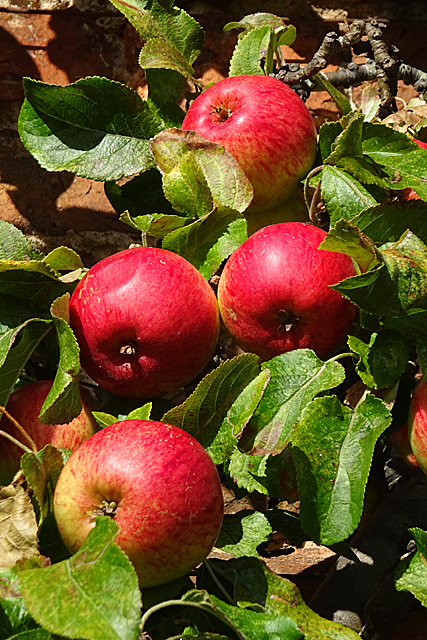
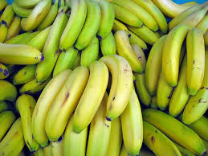

# **Markdown  Training Basics**
This text file has the purpose of training on markdown syntax writing based on microsoft website's  article **How to use Markdown Language to write docs**, which can be found through the following link:

[Link to Microsoft's article](https://docs.microsoft.com/en-us/contribute/how-to-write-use-markdown)
[Link to another referential article](https://daringfireball.net/projects/markdown/syntax)

## **Highlighting your ideas**
Sometimes you want to enphasize a topic or word with **bold** and *italic*, 
and it is made by simply adding \* before and after a word for italic and \** for bold; \*** will render in a bold and italic word. 

## **Training on headers**
When writing a text with markdown you might put your topics and subtopics under a "heading mark" in which they will be leveled based on how many hashtags you use before writing your line.
As exampled below:

 |Heading Mark number | Levels |
 |--------------------|--------|
 |          #         |   1    |
 |         ##         |   2    |
 |       ######       |   6    |

## **Markdown listing**

### Bulleted lists #

Each of your listed subjects has to be preceded by a \- character

 
- Fruits
- Vegetables 
- Carbohydrates
- Proteins

A nested list (Subtopics of the listed subjects) is made with an indentation before inserting "-" in your subtopic.

- Watermelons
  - *Citrulus ianatus*
  - Originated in the African continent
  - Rich in Potassium 
- Apples
  - *Malus domestica*
  - Originated in eastern Asia
  - Rich in Potassium
- Bananas
  - *Musa* spp.
  - Originated in southwestern Asia
  - Rich in Potassium

### Ordered (numbered) lists #

Each of your listed subjects has to be preceded by a "1." later it will be converted automatically to a ordered numeration.

1. First instruction
   1. Sub-instruction
   1. Sub-instruction
1. Second instruction

 
## **Blockquotes**  

In markdown we use e-mail style > characters to generate a blockquote, similar as in listing, inserting a > character below a blockquote will nest another into that blockquote.

  > This is how a blockquote looks like 
  >ashauidhudiuahduhiuhdidhuduahuhduashduhsdudaiuh
  >ashauidhudiuahduhiuhdidhuduahuhduashduhsdudaiuh
  >>This is how a nested blockquote looks like 
  > >ashauidhudiuahduhiuhdidhuduahuhduashduhsdudaiuh
  > >ashauidhudiuahduhiuhdidhuduahuhduashduhsdudaiuh
  > 
  >

--------------------------------------------------------------------------

## **Tables**

Simple tables can be created using pipes (|) for separating each column while hyphens (-) creates the column header. You must include a blank line before your table to render it correctly.

 |   Subject   | First semester grade | Second semester grade | Final grade |
 |-------------|----------------------|-----------------------|-------------| 
 |   English   |          A+          |          B+           |      A      |
 |     Math    |          B           |          A            |      B+     |
 |   History   |          A           |          D            |      C      |
 |  Chemistry  |          A+          |          A+           |      A+     |
 |   Biology   |          B+          |          A+           |      A      |

--------------------------------------------------------------------------

## **Inserting images**

 

--------------------------------------------------------------------------

 
--------------------------------------------------------------------------

 

--------------------------------------------------------------------------

## **Note blocks**

